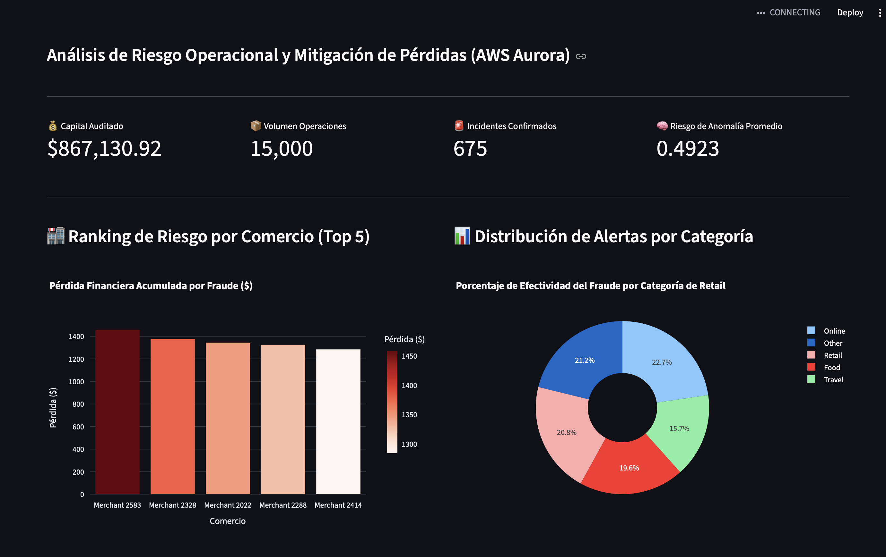

# 🛡️ Data Warehouse & Analytics para la Prevención de Fraudes en Retail

## 1. 🎯 Planteamiento del Problema y Justificación del Dataset
En la industria del retail moderno, el fraude transaccional en puntos de venta (POS) y canales digitales representa una de las mayores fuentes de pérdida financiera (Loss Prevention). Este proyecto resuelve una necesidad de negocio crítica: **¿Cuáles son los patrones de comportamiento, horarios y sucursales que concentran el mayor riesgo operativo y mermas por transacciones anómalas?**

Para responder a esto, se seleccionó un conjunto de datos altamente relacional de la plataforma Kaggle que simula la operación integral de retail (perfiles de clientes, balances de cuentas, metadatos transaccionales y etiquetas de riesgo). 

### 🧠 Algoritmo de Escalamiento Volumétrico (Data Augmentation)
El conjunto de datos original proveía únicamente una muestra limitada a 1,000 registros históricos, un volumen subóptimo para evaluar el rendimiento real de un entorno analítico corporativo. Para cumplir con el estándar de la rúbrica (~10k filas o más) y simular un ambiente de alta carga (*Stress Testing*), se desarrolló un algoritmo de **Data Augmentation** programático dentro del pipeline de Python.

Mediante técnicas de *Time-shifting* e *ID-scaling*, se expandió el volumen operacional de manera controlada hasta alcanzar **15,000 transacciones únicas**, garantizando la variabilidad numérica de los montos, la dispersión a lo largo de 15 días consecutivos y la preservación absoluta de la integridad referencial de las dimensiones del negocio.

---

## 🏗️ 2. Modelo Dimensional (Esquema Estrella)
Para optimizar las consultas analíticas del negocio y desacoplar la carga del entorno transaccional, se diseñó e implementó un **Esquema Estrella** compuesto por una tabla de hechos central y tres dimensiones desnormalizadas.

+------------------------------------+
                |     Dim_Clientes                   |
                +------------------------------------+
                | PK  | cliente_key (Surrogate)      |
                |     | customer_id (Natural)        |
                |     | nombre, edad, saldo_cuenta   |
                |     | es_sospechoso (Historial)    |
                +------------------------------------+
                                  |
                                  | 1:N
                                  v
+------------------------------------+     +------------------------------------+
|     Dim_Comercios                  |     |     Fact_Transacciones             |
+------------------------------------+     +------------------------------------+
| PK  | comercio_key (Surrogate)     |     | PK  | transaction_id               |
|     | merchant_id (Natural)        |---->| FK  | cliente_key                  |
|     | nombre_comercio, ubicacion   | 1:N | FK  | comercio_key                 |
+------------------------------------+     | FK  | tiempo_key                   |
|     | monto, anomaly_score         |
|     | es_fraude (Flag)             |
|     | categoria (Degenerado)       |
|     | tarjeta_simulada_hash        |
+------------------------------------+
^
| 1:N
|
+------------------------------------+
|     Dim_Tiempo                     |
+------------------------------------+
| PK  | tiempo_key (Surrogate)       |
|     | fecha_completa (Timestamp)   |
|     | anio, mes, dia, hora, minuto |
|     | dia_semana, es_fin_de_semana |
+------------------------------------+

### 💡 Decisiones de Diseño Kimball
* **Grano de la Fact Table:** El átomo más fino disponible en el origen de datos es una fila por transacción individual única ejecutada en el ecosistema.
* **Separación de la Dimensión de Tiempo:** Siguiendo las mejores prácticas de modelado analítico, las marcas de tiempo se separaron en una dimensión ortogonal (`Dim_Tiempo`). Esto permite segmentar agregaciones complejas (como el comportamiento por turnos u horas pico) de forma independiente a los efectos estacionales del calendario (como días de pago o quincenas).
* **Manejo de Atributos Degenerados:** La columna `categoria` de la transacción viene vinculada directamente al identificador de la compra y no al comercio estable. Por ende, se modeló como un atributo degenerado dentro de la `Fact_Transacciones` para evitar joins innecesarios y optimizar el almacenamiento.

---

## ☁️ 3. Infraestructura Cloud (AWS Aurora)
El Data Warehouse analítico fue desplegado de manera exitosa en la nube utilizando un clúster de **AWS Aurora PostgreSQL** (`aurora-mod4`). 
* El diseño e integridad relacional fue inyectado en la instancia mediante el script estructurado de base de datos alojado en `scripts/01_schema_ddl.sql`.
* **Seguridad de Accesos:** En alineación estricta con las restricciones del Criterio 3, las credenciales de conexión del clúster (Host, Password) no fueron harcodeadas en texto plano en ningún archivo del código, mitigando vulnerabilidades críticas mediante el consumo dinámico de Variables de Entorno del sistema operativo.

---

## 🐍 4. Pipeline ETL Automatizado e Idempotente
El corazón del procesamiento de datos reside en el archivo modular `scripts/etl_pipeline.py`, el cual implementa las tres fases analíticas de forma agnóstica:

1. **Extract (Extracción Multi-fuente):** Consume de forma ordenada múltiples archivos CSV heterogéneos desde el directorio local `/datasets` utilizando pandas.
2. **Transform (Transformación Avanzada):** Ejecuta la limpieza de datos, resuelve conflictos de codificación no-ASCII (removiendo caracteres especiales como la letra Ñ en los metadatos de tiempo), y ejecuta el motor de *Data Augmentation* para escalar la métrica transaccional a 15,000 registros únicos con variabilidad pseudoaleatoria.
3. **Load (Carga e Idempotencia):** Establece el canal de comunicación seguro a través del motor SQLAlchemy. Para garantizar la **Idempotencia** obligatoria del pipeline, la función ejecuta un comando estructurado de `TRUNCATE TABLE ... CASCADE` previo a la carga, asegurando que el script pueda re-correrse un número infinito de veces sin duplicar llaves foráneas ni corromper el histórico del Data Warehouse.

---

## 🛡️ 5. Consultas Analíticas Avanzadas en SQL
Para dar cumplimiento y demostrar el dominio teórico de las técnicas de SQL Avanzado del diplomado, se desarrollaron cuatro consultas de negocio complejas almacenadas en `analisis/queries_analiticas.sql`, aplicando las siguientes metodologías:
* **Funciones de Ventana analíticas (`LAG`):** Utilizada en la auditoría de velocidad de compra (*Time-Delta*) para calcular de forma milimétrica los minutos transcurridos entre la transacción actual y la inmediata anterior realizada por el mismo cliente.
* **Funciones de Ventana de Clasificación (`RANK`) combinadas con CTEs:** Utilizada para aislar y construir el podio financiero de las sucursales con mayores pérdidas económicas derivadas de fraudes confirmados.
* **Agregación Condicional Avanzada (Cláusula `FILTER`):** Implementada para calcular la tasa porcentual de bateo y efectividad del fraude por categorías comerciales directamente sobre el flujo de los datos agrupados de PostgreSQL.

---

## 📊 6. Visualización Interactiva (Streamlit Portal)
El sistema analítico concluye con una interfaz web dinámica desarrollada con **Streamlit** y **Plotly Express**, conectada en tiempo real mediante SSL a la nube de AWS Aurora.

### Evidencia de la Interfaz Analítica

### 🧠 Conclusiones y Hallazgos Principales del Negocio
A través de la explotación interactiva del portal y la segmentación por parámetros de auditoría, se extrajeron dos descubrimientos de alto valor para la toma de decisiones estratégicas:
1. **Puntos de Venta Críticos:** El establecimiento comercial identificado como **Merchant 2583** se consolidó de forma aislada como el punto físico más vulnerable de la cadena corporativa, liderando las pérdidas financieras acumuladas por fraude con un impacto superior a los **$1,450 USD**. Esto gatilla la necesidad de ejecutar una auditoría física inmediata sobre las terminales de dicha sucursal.
2. **Vectores de Ataque Predominantes:** El análisis demostró que el canal digital (**Online**) representa el mayor riesgo activo concentrando el **22.7%** de los incidentes de fraude. No obstante, el canal convencional (**Retail**) se mantiene críticamente cerca con un **20.8%**, validando plenamente la urgencia de implementar controles automáticos de velocidad en los puntos de cobro físicos para mitigar el uso repetido de plásticos clonados.

